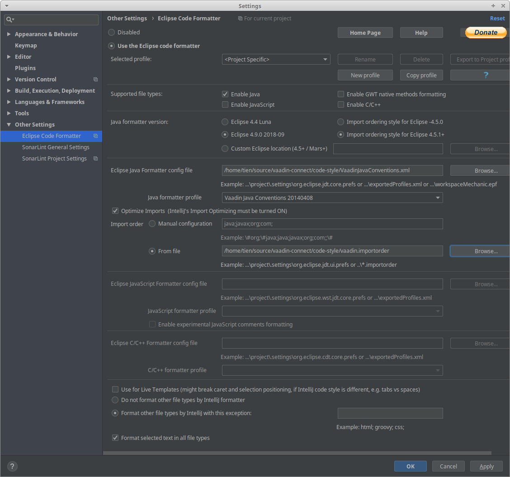

This directory contains code style settings for the Java part of the project.

The settings provided are in the Eclipse format in `VaadinJavaConventions.xml` file.

Eclipse users should import those settings, Intellij Idea users are required to 
install [Eclipse Code Formatter plugin](https://plugins.jetbrains.com/plugin/6546-eclipse-code-formatter)
and set it up the following way:

